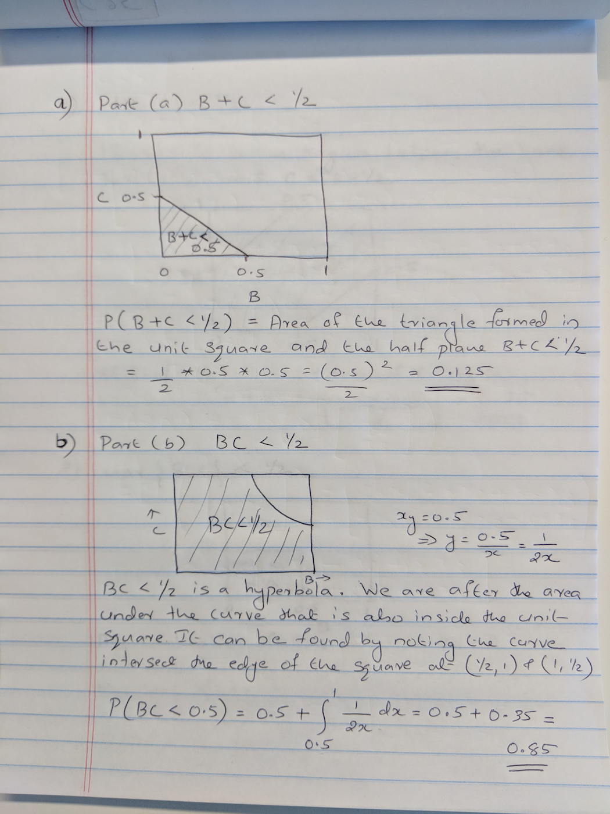
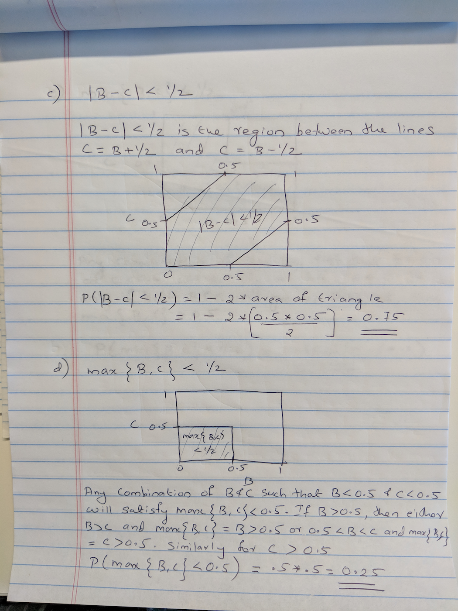
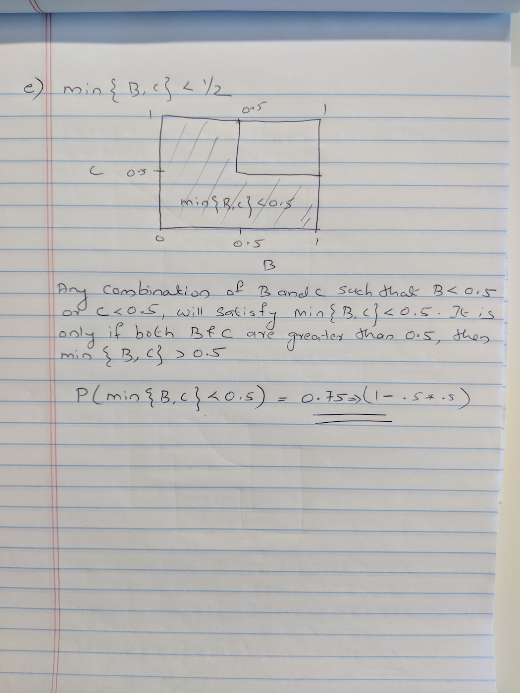

```{r setup, include=FALSE}
knitr::opts_chunk$set(echo = TRUE)
```

### Problem

Choose independently two numbers $B$ and $C$ at random from the interval $[0, 1]$ with
uniform density. Prove that $B$ and $C$ are proper probability distributions.

Find the probability that

  
  
  


