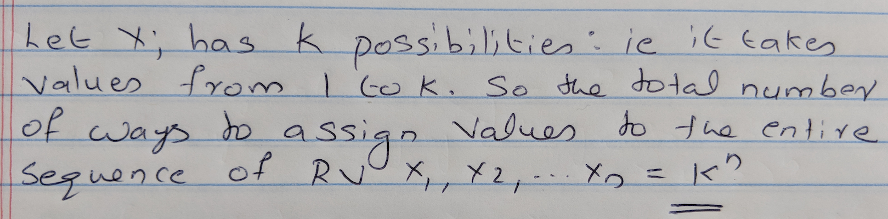
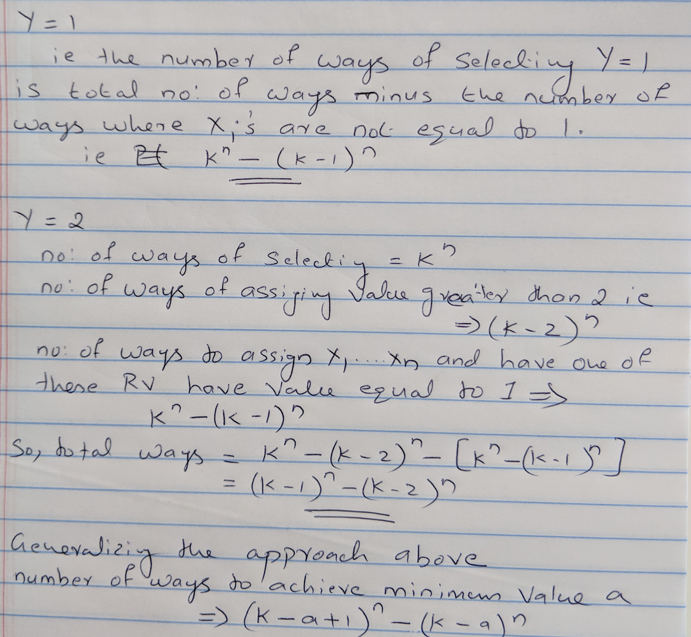

```{r setup, include=FALSE}
knitr::opts_chunk$set(echo = TRUE)
```

## Problem 1

 
 

## Problem 2.a

```
P(X > 8) = 1 - P(X <= 8) = 1 - [1 - 0.9^8] = 0.4305
E[X > 8] = 1/.1 = 10 years
SD = sqrt(0.9/0.1^2) = 9.4868 failures
```
```{r}
n = 8
p = 1/10
q = 1 - p
1-pgeom(n-1, p) 
(expected_value <- 1/p)
(sd <- sqrt(q/p^2))
```

## Problem 2.b
```
k = 8
lambda = 1/10 
P(T <= 8) = 1 - e^-lambda*k 
P(T > 8) = 1 - (1 - e^-lambda*k) = e^-0.1*8 = e^-0.8 = 0.4493289
E[T > 8] = 1/lambda = 10 years
SD = sqrt(1/lamda^2) = sqrt(100) = 10 failures
```
```{r}
lambda <- 1/10
k = 8
(prob <- pexp(k, lambda, lower.tail=FALSE))
(expected_value <- 1/lambda)
(standard_deviation <- sqrt(1/lambda^2))
```

## Problem 2.c
```
n = 8
p = 0.1
q = 0.9
k = 0
b(8,0.1,0) = 8C0 * 0.1^0 * (1 - 0.1)^(8 - 0) = 0.4304672
E[X] = np = 8 * 0.1 = 0.8 years
SD = sqrt(n*p*q) = sqrt(8 * 0.1 * 0.9) = 0.8485 failures
```
```{r}
n <- 8
p <- 1/10
q <- (1-p)
k <- 0
dbinom(k, n, p)
(expected_value <- n * p)
(std_deviation <- sqrt(n*p*q))
```

## Problem 2.d
```
lamda = 8/10 = 0.8
k = 0
Let X shows the number of failures in 8 years. So, the probability of 0 failures in 8 years will be:
P(X = 0) = lamda^k * e^-lamda / k! = 0.8^0 * e^-0.8 / 0! = 0.4493
E[X] = lambda = 0.8
SD = sqrt(lambda) = sqrt(0.8) = 0.8944 failures
```
```{r}
lambda = 8/10
k <- 0
ppois(0, lambda = 0.8)
(expected_value = 0.8)
(std_deviation = sqrt(expected_value))
```